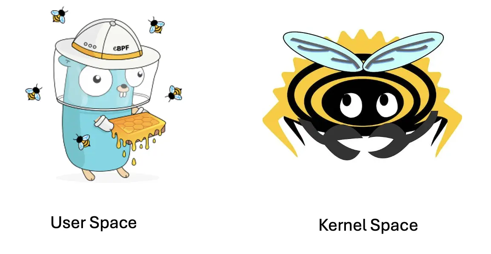
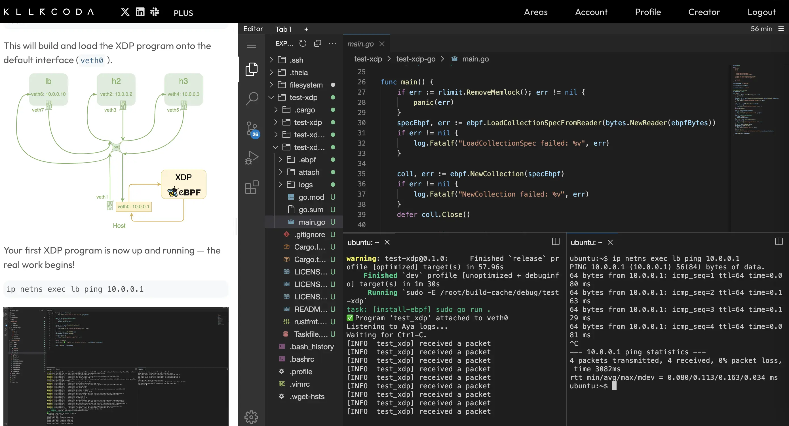
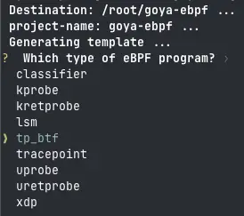
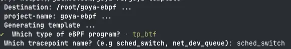

# What is it?

Goya is an eBPF framework which uses [Aya Framework](https://github.com/aya-rs/aya) for kernel space (In Rust) and [Cilium library](https://github.com/cilium/ebpf) (In Go) for user space.



# How to use it?

You need an [Aya environment](https://aya-rs.dev/book/start/development/), [go lang](https://go.dev/) and [task cli](https://taskfile.dev/) installed. You also can test on an [online lab](https://killercoda.com/aya-dev/course/aya-prod/goya).

[](https://killercoda.com/aya-dev/course/aya-prod/goya)

## Quick Start


### with XDP

If you want to test with docker, you can type:

```Bash
docker run --rm -it --name goya \
                    --privileged \
                    --network host \
                    -w /host/root/ \
                    -v /:/host \
                    -v /sys/kernel/debug:/sys/kernel/debug \
                    littlejo/aya:goya bash
```

* More info in [Dockerfile](./Dockerfile)

Now generate a new XDP project:

```Bash
cargo generate --name goya-xdp \
               -d program_type=xdp \
               -d default_iface=veth0 \
               https://github.com/goya-rs/goya-template
```

Compile and install the XDP "hello world" program:

```Bash
cd goya-xdp/
task
```

If you need to attach the program to another interface, you can run:

```Bash
task HOOK=veth1
```

### with an eBPF program

If you want to test with docker, you can type:

```Bash
docker run --rm -it --name goya \
                    --privileged \
                    --network host \
                    -w /host/root/ \
                    -v /:/host \
                    -v /sys/kernel/debug:/sys/kernel/debug \
                    littlejo/aya:goya bash
```

* More info in [Dockerfile](./Dockerfile)

```Bash
cargo generate --name goya-ebpf \
               https://github.com/goya-rs/goya-template
```

* Select the eBPF program and options




* Once code generated, Compile and install the eBPF "hello world" program:  

```Bash
cd goya-ebpf/
task
```

## How to custom the program?

There are two important directories:
* **`$project-ebpf`** (e.g. `goya-xdp-ebpf`): This directory contains the Rust Aya code that generates the eBPF kernel-space program. For more information, you can read the [Aya book](https://aya-rs.dev/book/).
* **`$project-go`** (e.g. `goya-xdp-go`): This directory contains the Go code (using Cilium libraries) that loads the eBPF binary into the Linux kernel.


## Limitation

* Currently works only with:
  * **XDP** programs
  * **classifier** programs
  * **kprobe** and **kretprobe** programs
  * **btf tracepoint** programs
  * **tracepoint** programs
  * **uprobe** and **uretprobe** programs
  * **LSM** programs
* **Aya logs** are limited to plain text (Macros like `:mac` and `:ip` are not supported) and there is no log level management

# Under the hood

## Cargo generate

The `cargo generate` command comes from the [cargo-generate](https://cargo-generate.github.io/cargo-generate/) crate. It uses boilerplates (see the [templating documentation](https://shopify.github.io/liquid/)) to generate code.

This project uses the [Goya template](https://github.com/goya-rs/goya-template), which is a fork of the original [Aya template](https://github.com/aya-rs/aya-template).

## Taskfile

With Aya, you normally just need to run `cargo run` to create your eBPF program. However, since this project involves both Rust and Go, I need a different solution to compile everything in a single command.

[Taskfile](https://taskfile.dev/) is a modern replacement for Makefile.

The `task` command mainly performs the following steps:

* Runs `cargo run` to generate the kernel-space eBPF program and copies it into the `$project-go/.ebpf` directory.
* Runs `go run .` inside the `$project-go` directory to load the eBPF binary into the kernel (with [cilium go library](https://ebpf-go.dev/])) and retrieve Aya logs (using a ring buffer map).

For more details, see the [Taskfile](https://github.com/goya-rs/goya-template/blob/main/Taskfile.yml).
